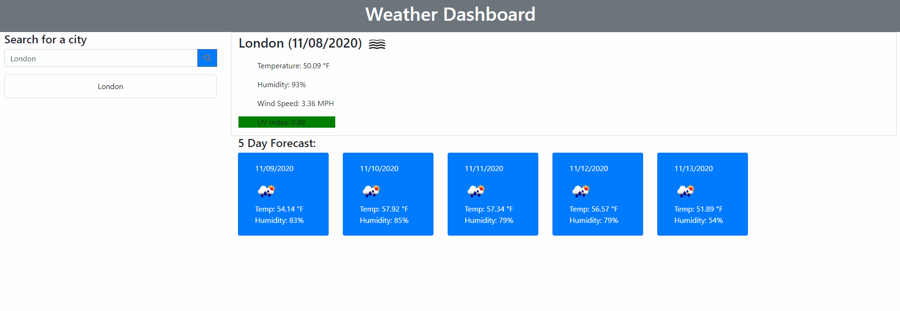

# HW6_Weather_Dashboard

### Overview

### Implementation
* Used https://openweathermap.org/ API for weather info.
* Maximized bootstrap for much of styling to eliminate a CSS file.
* JS and jQuery is the backbone, they worked in conjunction for the logic of the page. Such as storing the city create button functionality, assign color for UV index and append the weather details.
* Utilized moment.js for date stamp.

[Weather Dashboard Live Link](https://kaidong-chr.github.io/HW6_Weather_Dashboard/)

### Demonstration

### Installation

Preferred application and version controlled system.
* Visual Studio Code - https://code.visualstudio.com/download
* Git - https://git-scm.com/downloads

### Contributing

To contribute clone from the repo.
You can also fork or download from the repo, if you prefer to view or edit this in your own space.

### Credits

* Trilogy Education Services
* W3Schools
* Stackoverflow
* Bootstrap
* openweathermap

### License

Copyright © 2020 Kai Dong